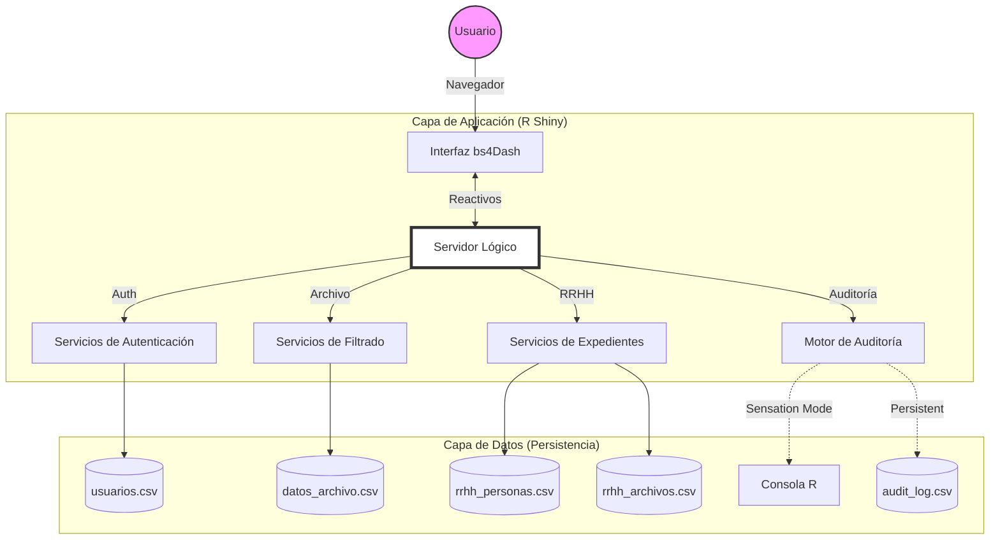
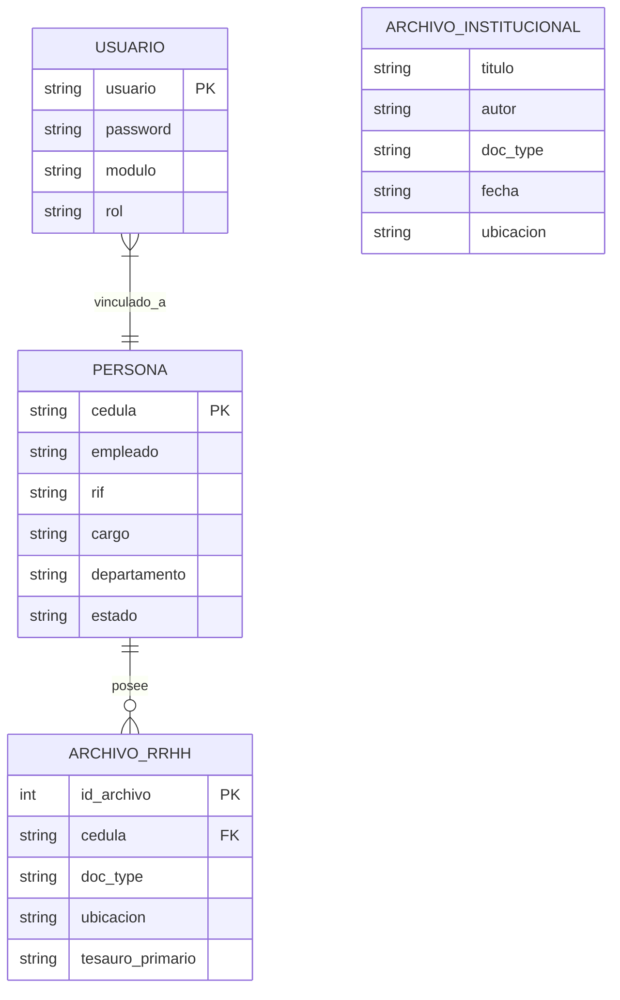
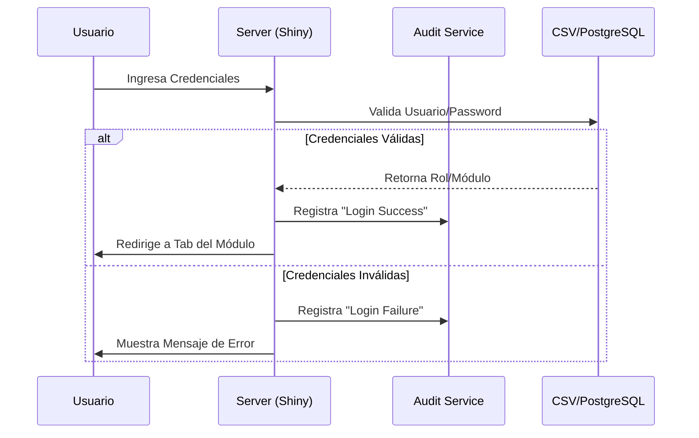
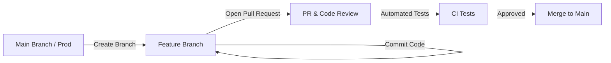
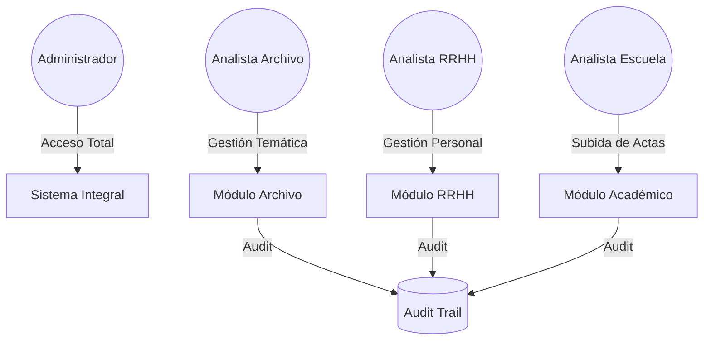

# Archivo Institucional: Ciencias UCV

Ecosistema de gestión documental de **Alta Eficiencia y Bajo Costo**. Diseñado para ofrecer una alternativa profesional, soberana y ligera a sistemas pesados, optimizando el uso de recursos tecnológicos en la Facultad de Ciencias UCV.

---

### 🌐 [Demo en Vivo (Entorno de Pruebas)](https://luisdavidcolina.shinyapps.io/ciencias-ucv-digital-archive/)

---

### 🚀 Inicio Rápido (Quick Start)
Si tienes R instalado, puedes ejecutar el prototipo localmente con estos comandos:

```r
# Instalar dependencias base
install.packages(c("shiny", "bs4Dash", "tidyverse", "DT"))

# Clonar y ejecutar (desde la consola de R)
shiny::runGitHub("ciencias-ucv-digital-archive", "luisdavidcolina")
```

---

## Misión e Impacto Institucional

Este proyecto nace de la necesidad de modernizar la gestión documental de la **Facultad de Ciencias UCV**, bajo tres pilares fundamentales:

1.  **Preservación Histórica**: Asegurar la integridad de la memoria documental de la facultad frente al deterioro físico y el paso del tiempo.
2.  **Soberanía Tecnológica**: Desarrollo local utilizando herramientas Open Source, eliminando la dependencia de licencias costosas y garantizando que el control total de los datos permanezca en la institución.
3.  **Eficiencia de Procesos**: Reducción drástica en los tiempos de respuesta para la consulta de expedientes de personal y actas académicas.

---

## Autorias

- Autor principal: Luisdavid Colina
- Co-autora: Lic. Susana Carvallo
- Facultad de Ciencias UCV

---

## Objetivos del Proyecto

### Objetivo General
Implementar una plataforma integral de gestión documental y digitalización para el archivo de la Facultad de Ciencias de la UCV, asegurando la preservación, trazabilidad y accesibilidad de la memoria histórica institucional, contemplando las necesidades particulares del área de Recursos Humanos para la gestión técnica y humana de sus expedientes de personal.

### Objetivos Específicos
- **Centralización**: Unificar los expedientes de RRHH y Archivo Institucional en un único repositorio seguro.
- **Eficiencia**: Optimizar la recuperación de información mediante motores de búsqueda avanzados y filtros de metadatos.
- **Transparencia**: Garantizar la integridad de los datos mediante sistemas de auditoría interna (Audit Trail).
- **Escalabilidad**: Diseñar una arquitectura capaz de migrar a entornos de bases de datos relacionales y almacenamiento en la nube sin pérdida de funcionalidad.
- **Segregación Funcional**: Independencia absoluta entre el módulo de **Archivo Institucional** y el de **Recursos Humanos**, garantizando que los datos, filtros y flujos de trabajo se mantengan estricta y lógicamente separados para proteger la confidencialidad y la especialización de cada área.

---

## Resumen funcional

El sistema implementa:

- Inicio de sesion con control de roles.
- Segmentacion por modulo de trabajo (Archivo y RRHH).
- Vista administrativa con panel de control.
- Buscador y filtros por metadatos (implementados como acordeones colapsables para simplificar el despliegue).
- Tarjetas de resultados con metadatos y ubicacion fisica.
- Modal de detalle de documento estilo DSpace e interfaz de expediente unificado para personal.
- Estadisticas filtrables para usuarios Admin.
- **Sistema de Auditoría (Audit Trail)**: Registro de cada acción crítica para cumplimiento legal.

### Diagrama de Arquitectura



## Cumplimiento de Estándares Internacionales

El diseño del sistema apunta a la normalización bajo marcos internacionales de archivística:

- **ISAD(G)**: Norma Internacional de Descripción Archivística para garantizar la representación multinivel de los fondos.
- **Dublin Core**: Esquema de metadatos estandarizado para la descripción de recursos digitales.
- **OAIS**: Modelo de referencia para la preservación digital a largo plazo en repositorios institucionales.

## Stack y arquitectura (Roadmap)

- **Lenguaje**: R
- **Framework**: Shiny (con `bs4Dash`)
- **Base de Datos**: Migración programada de CSV local a **PostgreSQL** para alta disponibilidad y escalabilidad.
- **Almacenamiento de Archivos**: Orquestación mediante **Buckets independientes** (S3/GCS) para desacoplar los archivos físicos del servidor de aplicaciones.
- **Motor de Búsqueda**: Implementación de **Búsqueda Semántica y Vectores** (**IA-powered**) bajo una filosofía de procesamiento **Edge** (local/privado). Esto garantiza una recuperación inteligente de información basada en contexto, manteniendo la soberanía de los datos dentro de la infraestructura institucional sin depender de nubes públicas externas.
- **Contenedores**: Soporte para **Docker** para garantizar despliegues consistentes y reproducibles en cualquier entorno.
- **Seguridad**: Sistema de **Respaldos Automáticos** y redundancia geográfica.

## Estructura del Proyecto

```text
ciencias-ucv-digital-archive/
├── R/                      # Lógica de Servicios y Backend
│   ├── server/             # Fragmentos del Servidor (Modales, UI dinámica)
│   ├── services_audit.R    # Motor de Auditoría
│   ├── services_auth.R     # Gestión de Usuarios
│   └── ...
├── data/                   # Datasets (CSV/Mock Data)
├── tests/                  # Pruebas Unitarias (testthat)
├── www/                    # Recursos Estáticos (CSS, Imágenes)
├── global.R                # Carga de librerías y datos globales
├── ui.R                    # Interfaz de Usuario
└── server.R                # Lógica Reactiva Principal
```

### Componentes Clave
- ui.R: layout general, login, sidebar, navbar, scripts JS de apoyo.
- server.R: orquestacion reactiva principal y ensamblaje de modulos.
- www/styles.css: estilo visual completo de la interfaz.
- R/services_auth.R: autenticacion local contra usuarios.csv.
- R/services_filters.R: filtros de busqueda cruzados para Archivo y RRHH.
- R/services_navigation.R: tab por defecto segun modulo y rol.
- R/services_pagination.R: utilidades de paginacion.
- R/server/ui_main_body.R: constructor del cuerpo principal (tabs Archivo, RRHH y Admin).
- R/server/stats_admin.R: salidas y reactivos del panel de estadisticas admin.
- R/server/document_modal.R: modal de documento y handlers de acciones integrales.
- R/services_audit.R: motor de trazabilidad y registro de eventos (Audit Trail).
- datos_extension.csv: dataset de documentos de Archivo (anteriormente catalogado como Extensión).
- rrhh_personas.csv: Tabla maestra relacional estática con la biografía del personal de RRHH.
- rrhh_archivos.csv: Tabla transaccional relacional con foliaturas y documentos atada por cédula.
- usuarios.csv: credenciales y roles de acceso.

## Eficiencia y Búsqueda Semántica (IA-powered Low-Cost)

A diferencia de otros sistemas que requieren servidores masivos para funciones inteligentes, este proyecto utiliza una arquitectura de **Cálculo Desacoplado**:

- **Búsqueda Semántica Optimizada**: El entendimiento del contexto (vectores) se pre-calcula al digitalizar, permitiendo búsquedas inteligentes con un consumo de RAM mínimo (**< 200MB adicionales**).
- **Escalabilidad Económica**: El uso de **PostgreSQL + pgvector** permite que el sistema maneje más de **10,000 registros** en un VPS económico, manteniendo tiempos de respuesta inferiores a un segundo.
- **Soberanía Tecnológica**: Todo el procesamiento se mantiene "Edge" (local), garantizando que la inteligencia del sistema no dependa de costos ocultos de nubes comerciales externas.
- **OCR Asíncrono y Ligero**: El reconocimiento de texto se realiza mediante **colas de procesamiento secuencial**. Esto evita picos de consumo de RAM al procesar un solo documento a la vez en momentos de baja carga del servidor, protegiendo la estabilidad del entorno de producción.

---

## Contrato de datos (Estructura Relacional)

Para asegurar la integridad de la información, el sistema utiliza un modelo relacional (actualmente en CSV, preparado para PostgreSQL):



### Detalle de Campos

## Credenciales de prueba actuales

- ext_normal / 1234 / modulo Archivo / rol Normal
- ext_admin / 1234 / modulo Archivo / rol Admin
- rrhh_normal / 1234 / modulo RRHH / rol Normal
- rrhh_admin / 1234 / modulo RRHH / rol Admin

## Flujo de autenticacion y navegacion

El sistema garantiza la seguridad y segregación mediante el siguiente flujo lógico:



### Proceso Técnico
1. El usuario ingresa credenciales en pantalla de login.
2. server valida con authenticate_user.
3. Si credenciales son validas, se guarda estado de sesion:
    - logged
    - username
    - modulo
    - rol
4. Se envia mensaje al cliente para navegar al tab de busqueda del modulo correspondiente.
5. El sidebar se renderiza dinamicamente segun modulo y rol.

---

## Motor de Búsqueda y Generación de Reportes

El corazón del sistema es su capacidad de **Recuperación Inteligente de Información**, optimizada para la eficiencia administrativa:

- **Búsqueda Multidimensional**: Los usuarios pueden cruzar filtros de **Fechas, Autores, Tipologías Documentales (Tesauro) y Estados de Expediente** para encontrar información crítica en milisegundos.
- **Exportación "Smart" (XLS)**: Con un solo clic, el sistema genera reportes en Excel de la vista filtrada actual, garantizando que el personal de la Facultad pueda realizar auditorías y listados físicos de forma automatizada.
- **Previsualización Reactiva**: El sistema permite abrir "Dossiers" digitales y previsualizar archivos sin perder los criterios de búsqueda, manteniendo el flujo de trabajo ágil.

---

## Modulo Archivo

- Filtros agrupados en Data Display de Acordeones colapsables en panel lateral (Tipología, Fecha, Tesauro).
- Selector integrado de Orden con soporte cronológico y alfabético (A-Z por defecto, Z-A, Recientes y Antiguos).
- Barra de busqueda con boton Buscar (icono) y boton Exportar XLS interactivos en el mismo bloque.
- Paginacion reactiva.
- Exportacion de resultados filtrados a archivo XLS.
- Tarjetas con acciones visuales completas para Admin.

## Modulo RRHH

- **Sistema de Expediente Único:** La vista por defecto acopla la información condensando siempre a la persona como un solo gran expediente (relación 1:1), sin "conteo general" numérico redundante ni mezclado.
- Busqueda directa por Apellidos, Nombres o cedula.
- Filtros agrupados en Data Display de Acordeones colapsables (Tipología, Fecha, Estado, Personas, Tesauro).
- Interfaz interna modal de Expediente Digital "Dossier": Presentación Full Dashboard con cabecera circular de Avatar y listado vertical secuencial de archivos mediante iteraciones nativas adaptables y responsivas en pantallas móviles.
- Selector de Orden lógico y funcional: "Alfabético (A-Z)" (defecto), "Alfabético (Z-A)", "Más recientes primero" y "Más antiguos primero" con reflejo idéntico al abrir modales.
- Exportacion de expediente consolidado por persona a archivo XLS.
- Tarjetas de presentación con metadatos de dependencia, AP y ubicacion resumida.

---

## Experiencia de Usuario y Diseño (UI/UX)

El sistema ha sido construido bajo una filosofía de **Diseño Centrado en el Usuario**, garantizando una curva de aprendizaje mínima y una operatividad máxima:

- **Interfaz Full Responsive**: Gracias al uso de `bs4Dash`, la aplicación es 100% adaptable. Funciona con fluidez en computadoras de escritorio, tablets y dispositivos móviles, permitiendo la consulta de expedientes en el sitio.
- **Navegación Intuitiva**: El diseño sigue los patrones de **AdminLTE 3**, ofreciendo una interfaz familiar, limpia y organizada que facilita la gestión de archivos complejos sin abrumar al usuario.
- **Micro-interacciones y Feedback**: Cada acción (búsqueda, login, exportación) cuenta con retroalimentación visual inmediata, asegurando una experiencia de usuario premium y profesional.
- **Inspiración y Evolución (DSpace++)**: La interfaz ha sido inspirada en la robustez funcional de **DSpace 7** (referencia mundial en repositorios institucionales), pero ha sido enriquecida con una experiencia de usuario más fluida, búsqueda reactiva y una presentación de expedientes mucho más intuitiva y moderna.

---

## Ajustes de interfaz recientes y reestructuraciones

Cambios aplicados en la iteración actual orientada a la experiencia de usuario y precisión de datos funcionales:

- **Identidad Extendida Modificada:** Reemplazo integral en documentación y terminología del modelo conceptual "Extensión" a su par conceptual "Archivo".
- **Estandarización de Semántica (Estado):** Cambio rotundo, normalización de UI, scripts CSV y reportes XLS donde se empleaba "Estatus" cambiándolo permanentemente a "Estado".
- **Perfiles Realistas RRHH:** Purgado y limpieza de pseudónimos departamentales (como Tesorería, Archivo Pasivo) inyectados erróneamente como personas relacionadas en `datos_rrhh.csv`, protegiendo la identidad singular de los metadatos.
- **Consistencia Visual con Acordeones:** Adopción del marco `bs4Accordion` del lado izquierdo de los buscadores tanto de RRHH como de Archivo para compactar y organizar flujos.
- **Base de Datos Relacional:** Partición del dataset RRHH en 2 entidades maestras separadas (`rrhh_personas.csv` y `rrhh_archivos.csv`) utilizando la lógica `1-to-N` ensambladas con `LEFT JOIN` en memoria R, erradicando metadatos duplicados.
- **Rediseño Modal Dashboard:** Renovación completa de las tarjetas y modales RRHH migrando de Tabs colapsantes en filas a una columna vertical semántica para optimizar la responsividad móvil.
- **Campos de Contexto Institucional:** Adición de RIF, Cargo y URL_Fotos (dinámicas) para cada usuario.
- **Enlace de Modal Persistente a ID Crudo:** Corrección de cruces de strings JSON que enviaba atributos alterados al backend, asegurando el acople estricto a las identificaciones `persona_raw`.

## Panel Admin

Incluye areas:

- Nuevo Ingreso
- Monitor de Expedientes
- Categorias
- Usuarios
- Estadisticas

En estadisticas se dispone de filtros analiticos por fecha, tipologia y campos especificos por modulo (usando la variable homologada de `estado`).

## Modal de documento

El modal muestra:

- Titulo y encabezado visual de perfiles integrados.
- Miniatura iconica con perfilado por tipología primaria.
- Metadata estricta segmentada.
- Pestañero lógico (pills) interior en caso de separar documentos/folios por módulo.
- Acciones de sistema (visualizar, editar, descargar).

Estado actual de acciones:

- Visualizar: placeholder en construccion.
- Editar: placeholder en construccion.
- Descargar: placeholder en construccion.

## Seguridad y Control de Acceso (RBAC Dinámico)

El sistema emplea una arquitectura de **RBAC Dinámico**, permitiendo no solo los roles predefinidos, sino la creación de perfiles personalizados según las necesidades de cada departamento (ej. Escuelas, Institutos):

| Facultad / Acción | Rol: Consulta | Rol: Editor | Rol: Administrador |
| :--- | :---: | :---: | :---: |
| **Búsqueda (Read)** | ✅ | ✅ | ✅ |
| **Descarga (Read)** | ✅ | ✅ | ✅ |
| **Subida de Actas (Create)** | ❌ | ✅ | ✅ |
| **Edición Masiva (Update)** | ❌ | ❌ | ✅ |
| **Eliminación (Delete)** | ❌ | ❌ | ✅ |
| **Gestión de Usuarios** | ❌ | ❌ | ✅ |
| **Auditoría (Audit Logs)** | ❌ | ❌ | ✅ |

---

- **Extensibilidad**: El sistema está preparado para integrar nuevas dependencias (ej. **Escuelas**) con permisos específicos para la gestión exclusiva de sus actas y consejos, sin comprometer la integridad de otros módulos.
- **Segregación Granular**: Los permisos se definen a nivel de módulo, garantizando que un usuario de la Escuela solo vea información académica y no datos sensibles de RRHH.

- **Segregación por Módulo**: Los usuarios solo pueden ver el módulo (Archivo o RRHH) para el cual fueron creados originalmente, independientemente de su rol.
- **Trazabilidad**: Todas las acciones permitidas en esta matriz son registradas por el motor de auditoría.

## Requisitos Mínimos

* **R (versión 4.x o superior)**: [Descargar R](https://cran.r-project.org/)
* **RStudio**: [Descargar RStudio](https://posit.co/download/rstudio-desktop/)
* **Paquetes Necesarios**: `shiny`, `bs4Dash`, `jsonlite`, `tidyverse`, `plotly`, `DT`, `shinyWidgets`

## Requisitos del Sistema

### Hardware Recomendado (Eficiencia Institucional)
El sistema está diseñado para operar en infraestructura de bajo costo (VPS económicos):

- **Requisito Mínimo (Desarrollo)**: 1 GB RAM / 1 vCPU.
- **Entorno de Producción (App + PostgreSQL)**: 2 GB RAM / 1-2 vCPUs. (Suficiente para el manejo fluido de decenas de miles de documentos).
- **Almacenamiento**: Dependiente de la volumetría de archivos PDF (escalable vía Buckets).

### Requisitos de Software
- **Entorno de Ejecución**: R versión 4.2.0 o superior (Instalación nativa recomendada para producción).
- **Base de Datos**: PostgreSQL 13+ (Opcional: CSV/SQLite para prototipos).
- **Contenedores**: Docker (Opcional, solo recomendado para desarrollo consistente).
- **Navegador**: Chrome, Firefox o Edge.

---

## Eficiencia y Comparativa Técnica
A diferencia de sistemas pesados (DSpace, Alfresco o Mayan Edms) que requieren infraestructuras costosas (8GB-16GB RAM), este desarrollo en R permite:
- **Bajo TCO**: Reducción drástica del costo de hosting.
- **Velocidad Nativa**: Procesamiento de datos en milisegundos sin capas de virtualización innecesarias en producción.

---

## Guía de Instalación y Ejecución

Elige el escenario que corresponda a tu caso:

### Escenario A: Si obtuviste el proyecto desde Git (Clonar)
1. Abre **RStudio**.
2. Ve a `File` > `New Project` > `Version Control` > `Git`.
3. Pega la URL del repositorio: `https://github.com/luisdavidcolina/ciencias-ucv-digital-archive.git`
4. Haz clic en **Create Project**.

### Escenario B: Si ya tienes el proyecto descargado en tu PC
1. Abre **RStudio**.
2. Abre el proyecto (`.Rproj`) desde la carpeta raíz.
3. Si no usas `.Rproj`, ubica la sesión en la carpeta manualmente escribiendo esto en la consola:
   ```r
   setwd("c:/ciencias-ucv-digital-archive")
   ```

---

## Cómo iniciar la aplicación

Una vez instaladas las dependencias (puedes instalarlas pegando este código en la consola: `install.packages(c("shiny", "bs4Dash", "jsonlite", "tidyverse", "plotly", "DT", "shinyWidgets"))`), tienes dos formas de iniciar la app desde RStudio:

**Opción A (Recomendada):**
Abre el archivo `app.R` y haz clic en el botón **"Run App"** que aparecerá en la barra superior derecha del editor.

**Opción B (Línea de comandos):**
Escribe el siguiente comando en la consola de RStudio:
```r
shiny::runApp("c:/ciencias-ucv-digital-archive")
```

> **Nota:** Se recomienda usar el archivo `app.R` para el inicio, ya que incluye validaciones de seguridad y mensajes de error más claros.

## Despliegue

Para publicar rápidamente una versión Demo a los servidores públicos de ShinyApps.io u otro contenedor Connect remoto:

```R
# Correr dentro de la consola nativa de RStudio (en la raíz del proyecto):
rsconnect::deployApp(".")
```

- Existe configuracion de despliegue local persistente en la carpeta rsconnect.
- Archivo de token auxiliar opcional presente en deploy_token.R.
- Para despliegues productivos corporativos, mover credenciales y tokens a variables de entorno seguras.

## Problemas conocidos y diagnostico

- Si aparece Error sourcing server.R, revisar primero sintaxis de bloques renderUI con multiples elementos.
- El bootstrap de app.R incluye safe_source y detalla archivo y motivo de falla.
- El proyecto usa codificacion UTF-8 para evitar errores por caracteres acentuados en Windows.

## Protocolo de Seguridad y Auditoría

Para garantizar la integridad y el **No-Repudio** de las acciones dentro del sistema, se ha implementado un motor de trazabilidad:

- **Registro de Eventos**: Cada inicio de sesión, consulta de expedientes de RRHH y exportación de datos queda grabado en `audit_log.csv`.
- **Atributos de Auditoría**: Se captura el usuario, la acción, el módulo afectado, el detalle del registro y la marca de tiempo exacta.
- **Transparencia Institucional**: Estos logs permiten auditorías forenses en caso de incidentes de seguridad o accesos no autorizados a datos sensibles.

---

## Historial reciente de arquitectura

Cambios estructurales aplicados en esta etapa:

- Ajuste profundo de índices que validan la correspondencia 1:1 para un "Expediente Único".
- Extraccion de constructor de cuerpo principal a R/server/ui_main_body.R.
- Extraccion de estadisticas admin a R/server/stats_admin.R.
- Extraccion de modal y handlers de documento a R/server/document_modal.R.
- Conexion de modulos desde global.R para mantener server.R mas compacto.
- Incorporacion de exportadores XLS modulares adaptables a "Archivo" y "RRHH".
- Consolidacion de tarjetas RRHH por persona y apertura de expediente unificado tras un controlador JS local.

## Estrategia de Calidad y Pruebas (QA)

Para garantizar la robustez de un sistema de gestión institucional, el proyecto sigue una estricta jerarquía de pruebas:

- **Pruebas Unitarias (`testthat`)**: Localizadas en `tests/testthat/`, cubren la lógica de filtrado, autenticación y procesamiento de metadatos.
- **Pruebas de Integración UI**: Implementación proyectada con `shinytest2` para validar flujos completos de usuario (Login -> Búsqueda -> Ver Detalle).
- **Control de Calidad de Código**: Uso de `lintr` para asegurar el cumplimiento de estándares de codificación de R (Tidyverse Style Guide).

**Ejecución de pruebas locales:**
```r
testthat::test_dir("tests/testthat")
```

---

## Ciclo de Vida y CI/CD

El proyecto está preparado para una integración continua profesional:

1. **Gestión de Entorno (`renv`)**: Se utiliza `renv` para congelar las versiones de las librerías, evitando fallos por actualizaciones inesperadas de paquetes.
2. **Automatización (GitHub Actions)**: Configuración opcional para ejecutar los tests automáticamente en cada Pull Request o Push a la rama principal.
3. **Logging y Auditoría**: Sistema de logs integrado para rastrear el flujo de autenticación y acceso a documentos sensibles.

---

## Próximos pasos y visión técnica

1. **Migración a Base de Datos Relacional**: Transicionar de archivos CSV a PostgreSQL.
2. **Implementación de Búsqueda Semántica**: Integrar procesamiento de lenguaje natural y vectores para búsquedas inteligentes en los documentos de Archivo.
3. **Desacoplamiento de Archivos**: Configurar el servicio de Bucket para almacenamiento externo de archivos.
4. **Infraestructura de Backup**: Automatizar los respaldos de la base de datos y archivos.
5. **Cobertura de Pruebas**: Incrementar el coverage de tests unitarios al 90% de los servicios de backend.
6. **Módulo de Analítica Avanzada**: Expandir el panel de estadísticas con visualizaciones interactivas de Plotly.

## Glosario de Términos

- **Tesauro**: Lista controlada de términos (descriptores) que se utilizan para representar conceptos y facilitar la búsqueda temática.
- **ISAD(G)**: Norma Internacional General de Descripción Archivística. Proporciona una guía para la preparación de descripciones archivísticas consistentes.
- **Audit Trail (Pista de Auditoría)**: Registro cronológico de actividades del sistema que permite reconstruir y examinar flujos de eventos.
- **Dublin Core**: Conjunto de 15 elementos de metadatos básicos para la descripción de recursos digitales en la web.
- **No-Repudio**: Garantía de que quien realiza una acción en el sistema no puede negar haberla realizado (respaldado por los logs de auditoría).

---

## Política de Seguridad y Privacidad

Dada la naturaleza sensible de la información gestionada (especialmente en el módulo de RRHH), el sistema se rige por los siguientes principios:

1. **Confidencialidad (CIA Triad)**: Acceso restringido estrictamente por roles (Admin/Normal) y módulos (Archivo/RRHH). No existe cruce de visibilidad entre áreas sin la autorización debida.
2. **Integridad de los Datos**: Uso de validaciones en servidor para asegurar que la información no sea alterada de forma corrupta.
3. **Privacidad por Diseño**: Los datos de carácter personal (DCP) como Cédulas y RIF se manejan bajo protocolos de visualización segura.
4. **Trazabilidad Total**: Cada interacción con datos sensibles queda registrada en el sistema de auditoría interno.

---

## Gestión de Proyecto y Metodología

Para garantizar el éxito institucional y la entrega continua de valor, el proyecto se gestiona bajo marcos de trabajo modernos y transparentes:

### Metodología Ágil (Agile & Scrum)
El desarrollo se realiza mediante ciclos iterativos (Sprints) que permiten adaptar el software a los requisitos cambiantes de la Facultad. Se prioriza el desarrollo funcional sobre la documentación exhaustiva, aunque manteniendo el rigor de ingeniería.

### Tablero Kanban (GitHub Projects)
La gestión de tareas, bugs y nuevas funcionalidades se realiza mediante un tablero **Kanban** en **GitHub Projects**. Esto permite una trazabilidad total del estado del proyecto:
- **To-Do**: Tareas pendientes y nuevas ideas.
- **In Progress**: Funcionalidades bajo desarrollo activo.
- **Review**: Código en fase de QA y pruebas unitarias.
- **Done**: Funcionalidades desplegadas y validadas.

### Flujo de Trabajo (GitHub Flow)
Adoptamos el estándar **GitHub Flow** para asegurar la estabilidad de la rama principal:



---

## Casos de Uso del Sistema

El sistema ha sido diseñado pensando en los actores clave de la Facultad:



## Diccionario de Datos Detallado (Entidades Core)

### rrhh_personas.csv
| Campo | Tipo | Requerido | Descripción |
| :--- | :--- | :---: | :--- |
| `cedula` | String (PK) | Sí | Identificador nacional único del empleado. |
| `empleado` | String | Sí | Nombre completo del titular. |
| `rif` | String | No | Registro de Información Fiscal. |
| `cargo` | String | Sí | Posición nominal en la Facultad. |
| `departamento` | String | Sí | Adscripción administrativa. |
| `estado` | Factor | Sí | Situación laboral (Activo, Jubilado, etc). |

---

## Gobernanza y Mantenimiento

Para asegurar la longevidad y profesionalismo del proyecto, se siguen las siguientes normas de gobernanza:

- **Versionado Semántico**: Se utiliza el estándar **SemVer 2.0.0** (MAJOR.MINOR.PATCH) para el etiquetado de versiones.
- **Validación de Cambios**: Cualquier modificación en la estructura de datos (CSVs) o lógica de servicios debe ser validada mediante la suite de pruebas unitarias (`testthat`).
- **Mantenimiento Simplificado**: Gracias a la elección de **R** (un lenguaje legible y versátil) y una **Arquitectura Modular** (con archivos de servicios independientes), el sistema es extremadamente fácil de mantener, actualizar y escalar por futuros equipos técnicos institucionales, eliminando la curva de aprendizaje de sistemas pesados.
- **Propiedad Intelectual**: Todos los derechos reservados. El uso y distribución queda a discreción total de sus autores originales.

---

## Licencia y Uso

Todos los derechos reservados. El uso, copia, modificación o distribución de este software está **estrictamente prohibido** sin la autorización expresa y por escrito de los autores (**Luisdavid Colina** y **Susana Carvallo**). Este software se protege bajo las leyes de propiedad intelectual vigentes.

---

## Creditos

Documentacion y desarrollo: **Luisdavid Colina** & **Lic. Susana Carvallo**