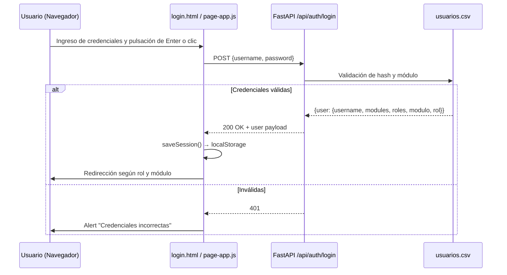
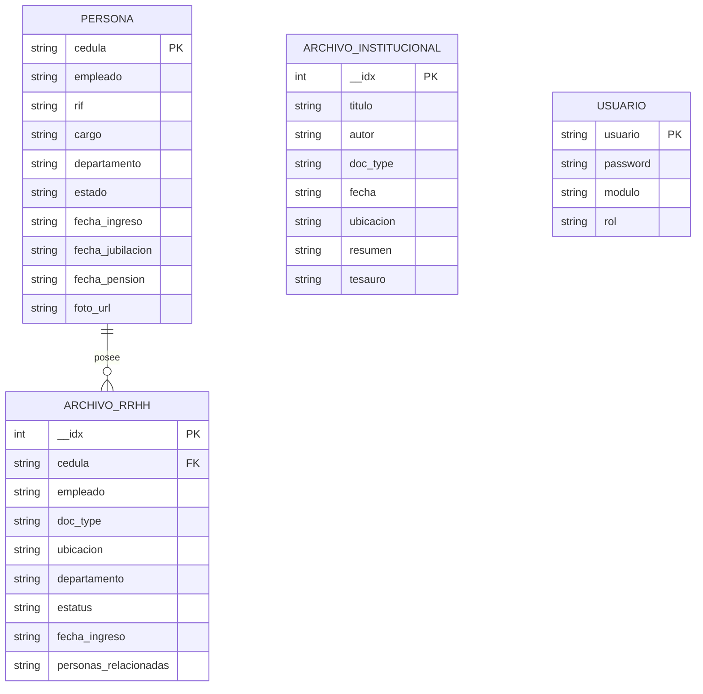

# Archivo Institucional: Ciencias UCV

Ecosistema de gestión documental de **Alta Eficiencia y Bajo Costo**. Diseñado para ofrecer una alternativa profesional, soberana y ligera a sistemas pesados, optimizando el uso de recursos tecnológicos en la Facultad de Ciencias UCV.

---

## Misión e Impacto Institucional

El proyecto surge de la necesidad de modernizar la gestión documental de la **Facultad de Ciencias UCV**, bajo tres pilares fundamentales:

1. **Preservación Histórica**: Asegurar la integridad de la memoria documental de la facultad frente al deterioro físico y el paso del tiempo.
2. **Soberanía Tecnológica**: Desarrollo local utilizando herramientas Open Source, eliminando la dependencia de licencias costosas y garantizando que el control total de los datos permanezca en la institución.
3. **Eficiencia de Procesos**: Reducción drástica en los tiempos de respuesta para la consulta de expedientes de personal y actas académicas.

---

## Autorías

- Autor principal: Luisdavid Colina
- Co-autora: Lic. Susana Carvallo
- Facultad de Ciencias UCV

---

## Objetivos del Proyecto

### Objetivo General
Implementar una plataforma integral de gestión documental y digitalización para el archivo de la Facultad de Ciencias de la UCV, asegurando la preservación, trazabilidad y accesibilidad de la memoria histórica institucional, contemplando las necesidades particulares del área de Recursos Humanos para la gestión técnica y humana de sus expedientes de personal.

### Objetivos Específicos
- **Centralización**: Unificar los expedientes de RRHH y Archivo Institucional en un único repositorio seguro.
- **Eficiencia**: Optimizar la recuperación de información mediante motores de búsqueda avanzados y filtros de metadatos.
- **Transparencia**: Garantizar la integridad de los datos mediante sistemas de auditoría interna (Audit Trail).
- **Escalabilidad**: Diseñar una arquitectura capaz de migrar a entornos de bases de datos relacionales y almacenamiento en la nube sin pérdida de funcionalidad.
- **Segregación Funcional**: Independencia absoluta entre el módulo de **Archivo Institucional** y el de **Recursos Humanos**, garantizando que los datos, filtros y flujos de trabajo se mantengan estricta y lógicamente separados para proteger la confidencialidad y la especialización de cada área.

---

## Stack Tecnológico Actual

| Capa | Tecnología |
| :--- | :--- |
| Backend | Python 3.11 + FastAPI 0.110 |
| Servidor | Uvicorn 0.28 |
| Datos | Pandas 2.2 + CSV (listo para PostgreSQL) |
| Frontend | HTML5 / Vanilla JS (ES2020) |
| UI Framework | Bootstrap 4.6.2 |
| Filtros multi-select | Tom Select 2.3.1 |
| Iconos | Font Awesome 6 |
| Despliegue | Render.com (Python 3.11.9 pinned) |

> El proyecto migró de R/Shiny a Python/FastAPI para mayor portabilidad, velocidad de arranque y facilidad de despliegue en contenedores.

---

## Inicio Rápido

```bash
cd python-app
pip install -r requirements.txt
python -m uvicorn main:app --reload --port 8000
```

La aplicación se accede desde el navegador en `http://127.0.0.1:8000`.

### Credenciales de prueba

| Usuario | Contraseña | Módulo | Rol |
| :--- | :--- | :--- | :--- |
| archivo_normal | 1234 | Archivo | Normal |
| archivo_admin | 1234 | Archivo | Admin |
| rrhh_normal | 1234 | RRHH | Normal |
| rrhh_admin | 1234 | RRHH | Admin |

---

## Arquitectura

```mermaid
graph TD
    User((Usuario)) -->|Navegador| HTML[Páginas HTML Estáticas]

    subgraph "Frontend (Vanilla JS)"
        HTML --> AppJS[app.js — núcleo compartido]
        AppJS --> ArchivoJS[archivo.js]
        AppJS --> RrhhJS[rrhh.js]
        AppJS --> AdminJS[admin.js]
        HTML --> LoginJS[page-app.js — solo login]
    end

    subgraph "Backend (FastAPI / Python)"
        AppJS -->|REST JSON| API[main.py]
        API --> Auth[POST /api/auth/login]
        API --> Choices[GET /api/choices]
        API --> ArchivoAPI[POST /api/archivo/buscar]
        API --> RrhhAPI[POST /api/rrhh/buscar]
        API --> ProfileAPI[POST /api/rrhh/person/profile]
        API --> AdminAPI[/api/admin/*]
    end

    subgraph "Capa de Datos"
        API --> DatosArchivo[(datos_archivo.csv)]
        API --> RrhhPersonas[(rrhh_personas.csv)]
        API --> RrhhArchivos[(rrhh_archivos.csv)]
        API --> Usuarios[(usuarios.csv)]
        API --> AuditLog[(audit_log.csv)]
    end
```

---

## Estructura del Proyecto

```text
ciencias-ucv-digital-archive/
├── python-app/
│   ├── main.py                 # FastAPI: rutas, modelos Pydantic, lógica de negocio
│   ├── requirements.txt        # fastapi, uvicorn, pandas, python-multipart
│   ├── .python-version         # 3.11.9 (pinned para Render)
│   └── static/
│       ├── app.js              # Núcleo JS: state, auth, Tom Select, eventos
│       ├── archivo.js          # Búsqueda/render Archivo Institucional
│       ├── rrhh.js             # Búsqueda/render RRHH + modal de expediente
│       ├── admin.js            # Panel administrativo (estadísticas, ingreso, monitor)
│       ├── page-app.js         # Login exclusivo (solo cargado por login.html)
│       ├── styles.css          # Estilos globales + componentes DS
│       ├── login.html          # Página de autenticación
│       ├── archivo.html        # Módulo Archivo Institucional
│       ├── rrhh.html           # Módulo RRHH
│       ├── admin_archivo.html  # Panel Admin — Archivo
│       ├── admin_rrhh.html     # Panel Admin — RRHH
│       ├── index.html          # SPA legacy (conservada, carga todos los módulos)
│       ├── logo.png
│       ├── logoblanco.png
│       └── assets/icons/       # Favicons (ico, png, webmanifest)
├── datos_archivo.csv           # Fondo documental del Archivo Institucional
├── rrhh_personas.csv           # Tabla maestra de personal (1 fila = 1 persona)
├── rrhh_archivos.csv           # Tabla de folios/documentos (N filas por persona)
├── usuarios.csv                # Credenciales y roles
└── audit_log.csv               # Registro de eventos del sistema
```

---

## API Endpoints

### Autenticación
| Método | Ruta | Descripción |
| :--- | :--- | :--- |
| POST | `/api/auth/login` | Valida credenciales, retorna `{user}` con módulo y rol |
| POST | `/api/auth/restore` | Restaura sesión desde token de `localStorage` |

### Datos
| Método | Ruta | Descripción |
| :--- | :--- | :--- |
| GET | `/api/choices` | Retorna listas para filtros: doc_types, tesauro, estados, personas |
| POST | `/api/archivo/buscar` | Búsqueda en Archivo con filtros (tipo, tesauro, fechas, orden) |
| POST | `/api/rrhh/buscar` | Búsqueda en RRHH con filtros (tipo, estado, personas, fechas, orden) |
| POST | `/api/rrhh/person/profile` | Perfil completo + folios de una persona por `persona_raw` |

### Administración
| Método | Ruta | Descripción |
| :--- | :--- | :--- |
| POST | `/api/admin/stats` | KPIs y estadísticas del módulo |
| POST | `/api/admin/submit` | Ingresa un nuevo documento/folio |
| GET | `/api/admin/list_all` | Lista todos los registros (con búsqueda y filtro de tipo) |
| POST | `/api/admin/add_category` | Crea nueva categoría/tipología documental |
| GET | `/api/admin/users` | Lista todos los usuarios |
| POST | `/api/admin/users/create` | Crea nuevo usuario |

### Páginas
| Ruta | Página servida |
| :--- | :--- |
| `/` | Redirige a `/login` |
| `/login` | login.html |
| `/archivo` | archivo.html |
| `/rrhh` | rrhh.html |
| `/admin/archivo` | admin_archivo.html |
| `/admin/rrhh` | admin_rrhh.html |

---

## Arquitectura Frontend JS

Los módulos comparten el scope global de `window`. El orden de carga es crítico:

```
app.js  →  archivo.js / rrhh.js / admin.js
```

`app.js` define primero: `state`, `API_BASE`, `tsInstances`, helpers (`formatISOToSpanish`, `getPersonInitials`, `getStatusColor`), lógica de sesión y Tom Select.

Los módulos domain usan esas variables directamente sin necesidad de imports.

### Estado global (`state`)

```js
state = {
  user: null,
  archivo:  { search, selectedTypes, selectedTesauro, dateStart, dateEnd, sortMode, results, page, perPage },
  rrhh:     { search, selectedTypes, selectedEstados, selectedPeople, dateStart, dateEnd, sortMode, results, page, perPage },
  choices:  { archivo: { doc_types, tesauro, min_date, max_date }, rrhh: { doc_types, estados, people } },
  activePersonProfile: null,
  innerDossierSearch, innerDossierClass, innerDossierSort,
  activeAdminTab,
  adminTable: { results, page, perPage },
  tsInstances: {}
}
```

---

## Módulos Funcionales

### Archivo Institucional (`archivo.html`)
- Búsqueda full-text por título, autor, resumen.
- Filtros: Tipología documental, Tesauro (multi-select Tom Select), rango de fechas.
- Orden: Alfabético A-Z / Z-A, Más recientes, Más antiguos.
- Paginación reactiva.
- Modal de detalle estilo Dublin Core (metadatos `dc.*`).

### RRHH (`rrhh.html`)
- Búsqueda por apellidos, nombres o cédula.
- Filtros: Tipología, Estado laboral, Personas vinculadas (multi-select), rango de fechas.
- Tarjetas de persona con foto (si disponible) o iniciales con fondo institucional.
- Modal de **Expediente Digital (Dossier)**:
  - Cabecera con avatar 150px, nombre, cargo, adscripción, cédula, RIF, fechas de ingreso/jubilación/pensión.
  - Filtros internos: búsqueda libre, categoría, orden.
  - Documentos agrupados por categoría con metadatos de dependencia, estatus y ubicación física.
- Colores de estado: Activo (verde), Retirado (rojo), Jubilado (violeta), Pensionado (naranja).

### Panel Admin (`admin/archivo`, `admin/rrhh`)
- **Estadísticas**: KPIs (total documentos, tipos, usuarios activos, fecha más reciente).
- **Nuevo Ingreso**: Formulario dinámico adaptado al módulo (Archivo o RRHH) con Tom Select para tipo documental.
- **Monitor**: Tabla paginada de todos los registros con búsqueda y filtro por tipo.
- **Categorías**: Lista y creación de tipologías documentales.
- **Usuarios**: Lista y creación de nuevos usuarios con asignación de módulo y rol.

---

## Flujo de Autenticación



### Redirección post-login

| Rol | Módulo | Destino |
| :--- | :--- | :--- |
| Admin | Archivo | `/admin/archivo` |
| Admin | RRHH | `/admin/rrhh` |
| Normal | Archivo | `/archivo` |
| Normal | RRHH | `/rrhh` |

### Sesión

La sesión se persiste en `localStorage` bajo la clave `"archive_session"` con estructura:
```json
{ "username": "...", "modules": [...], "roles": {...}, "modulo": "...", "rol": "...", "ts": 1234567890 }
```

---

## Contrato de Datos



---

## Control de Acceso (RBAC)

| Acción | Normal | Admin |
| :--- | :---: | :---: |
| Búsqueda y consulta | ✅ | ✅ |
| Ver modal de documento/expediente | ✅ | ✅ |
| Ingresar nuevo documento | � | ✅ |
| Monitor de expedientes | � | ✅ |
| Gestión de categorías | � | ✅ |
| Gestión de usuarios | � | ✅ |
| Ver estadísticas | � | ✅ |

La segregación por módulo es absoluta: un usuario de Archivo no puede acceder a rutas RRHH y viceversa.

---

## Cumplimiento de Estándares

- **ISAD(G)**: Norma Internacional de Descripción Archivística.
- **Dublin Core**: Esquema de metadatos en el modal de Archivo (`dc.title`, `dc.contributor.author`, `dc.date.issued`, `dc.type`, `dc.identifier.location`, `dc.subject.classification`).
- **OAIS**: Modelo de referencia para preservación digital a largo plazo.

---

## Historial de Desarrollo — Iteraciones Recientes

### Migración R/Shiny → Python/FastAPI
- Reescritura total del backend en FastAPI con Pandas para lectura de CSV.
- Frontend migrado de bs4Dash (R) a HTML/JS vanilla + Bootstrap 4.6.
- Arquitectura multi-página independiente (cada ruta sirve su propio HTML).
- Sesión migrada de variables reactivas de Shiny a `localStorage`.
- Despliegue en Render.com con Python 3.11.9 pinned.

### Modularización del Frontend
El `app.js` original (1747 líneas monolítico) fue dividido en 4 archivos:

| Archivo | Responsabilidad |
| :--- | :--- |
| `app.js` (~320 líneas) | Núcleo: state, auth, session, Tom Select, helpers globales |
| `archivo.js` | Búsqueda, render y modal del módulo Archivo |
| `rrhh.js` | Búsqueda, render, dossier y modal del módulo RRHH |
| `admin.js` | Panel admin: estadísticas, ingreso, monitor, categorías, usuarios |

Bugs corregidos durante la modularización:
- `openDocMetadataModal` usaba `.files` — corregido a `.rows` (campo real de la API).
- Color de estado "Jubilado" estaba duplicado como "Retirado" — corregido en `getStatusColor`.
- Filtro de personas RRHH no estaba conectado (Tom Select sin wiring, payload sin `people_terms`, `state.rrhh.selectedPeople` inexistente) — corregido.
- Campo `e.value` en el handler de sort (debía ser `e.target.value`) — corregido.
- `reg-personas` sin sufijo en `renderDynamicSubmitFields` no coincidía con `handleNewSubmission` — corregido.

### Modal Expediente RRHH
- Rediseño del dossier: avatar circular 150px, layout flex fila, datos en grid.
- Documentos agrupados por categoría (`doc_type`) con cabecera por sección.
- Filtros internos: búsqueda libre, selector de categoría, selector de orden.
- Contador de "folios visibles" reactivo.
- Modal ampliado a 1080px con scroll interno limitado a 78vh.

### Fotos en tarjetas RRHH
- Campo `foto_url` agregado al índice `build_rrhh_person_index` en `main.py`.
- Las tarjetas de resultados muestran la foto directamente en el círculo de avatar si está disponible; si no, muestran iniciales con fondo institucional (`#2b4e72`).

### Login
- Enter funciona desde cualquier campo o punto de la página (handler en `document`).
- `chooseLandingPage` en `page-app.js` redirige admins a `/admin/archivo` o `/admin/rrhh` según módulo.

### `page-app.js`
- Limpieza: eliminadas ~250 líneas de código muerto (funciones de páginas no-login que nunca se ejecutaban desde este archivo).
- Funciones conservadas: `initLoginPage`, `performLogin`, `saveSession`, `chooseLandingPage`.

---

## Pendiente / Próximos Pasos

### Funcionalidades críticas
- [ ] **Favicon en sidebar**: mostrar el logo/favicon al lado de "Ciencias UCV" en la barra lateral de todas las páginas.
- [ ] **Visor de documentos digitalizados**: el botón "Abrir archivo" en el dossier RRHH y el modal de Archivo abren un `alert()` placeholder — se debe implementar un visor real (PDF en iframe o ventana nueva).
- [ ] **Descarga de expediente XLS**: el botón de descarga en el modal del dossier aún es placeholder — implementar la exportación del expediente filtrado a Excel.
- [ ] **Edición de registros**: el botón "Editar" en el panel admin es placeholder — implementar un formulario de edición inline o modal.

### Mejoras técnicas
- [ ] **Paginación en módulo Archivo y RRHH**: los botones de página existen en el HTML, pero los handlers `prev`/`next` necesitan revisión de wiring en `app.js`.
- [ ] **Búsqueda semántica / vectorial**: integrar `sentence-transformers` o pgvector para recuperación por contexto.
- [ ] **Migración a PostgreSQL**: reemplazar CSV por base de datos relacional para concurrencia y escalabilidad.
- [ ] **Almacenamiento de archivos**: configurar bucket S3/GCS para desacoplar PDFs del servidor.
- [ ] **Tests**: no hay cobertura de tests en el stack Python — agregar `pytest` con tests de los endpoints críticos.
- [ ] **Exportación a XLS desde monitor admin**: el monitor lista registros, pero no permite exportar.
- [ ] **SPA `index.html`**: evaluar si mantener o deprecar — actualmente duplica las páginas standalone.

### Deuda técnica
- [ ] El campo `audit_log.csv` se escribe, pero su contenido no es consultable desde ninguna vista de la UI.
- [ ] `datos_test.csv` en la raíz — revisar si es necesario o puede eliminarse.
- [ ] La función de restaurar sesión (`/api/auth/restore`) existe en el backend, pero no está siendo llamada en el frontend al recargar páginas protegidas.

---

## Requisitos del Sistema

### Backend
- Python 3.11.9
- Ver `requirements.txt`: `fastapi==0.110.0`, `uvicorn==0.28.0`, `pandas==2.2.1`, `python-multipart==0.0.9`

### Hardware (Producción)
- Mínimo: 512 MB RAM / 1 vCPU (suficiente para CSV + FastAPI sin concurrencia masiva)
- Recomendado: 1 GB RAM / 1 vCPU

### Navegador
- Chrome, Firefox o Edge modernos (ES2020 nativo requerido)

---

## Despliegue en Render.com

El proyecto está configurado para despliegue en Render con Python 3.11.9 pinned via `.python-version`.

```bash
# Build command
pip install -r requirements.txt

# Start command
uvicorn main:app --host 0.0.0.0 --port $PORT
```

---

## Despliegue en Vercel

El proyecto incluye soporte para despliegue serverless en [Vercel](https://vercel.com) a través del archivo `api/index.py`.

### Requisitos
- Cuenta en Vercel.
- CLI de Vercel instalado globalmente: `npm i -g vercel`.

### Instrucciones

1.  **Inicio de sesión** desde la raíz del repositorio:
    ```bash
    vercel login
    ```

2.  **Configuración del proyecto** (solo la primera vez):
    ```bash
    vercel
    ```
    El asistente guía el proceso para vincular el repositorio.

3.  **Despliegue** (para actualizaciones posteriores):
    ```bash
    vercel --prod
    ```

### Cómo funciona
- Vercel detecta automáticamente el archivo `api/index.py` y lo expone como una función serverless.
- `api/index.py` importa y expone el objeto `app` de FastAPI desde `python-app/main.py`.
- Los archivos estáticos de `python-app/static/` se sirven a través del middleware de FastAPI.

### Consideraciones
- La capa de datos (PostgreSQL/Neon) debe estar accesible desde internet y su `DATABASE_URL` debe configurarse como variable de entorno en el panel de Vercel.
- Las sesiones y el `audit_log` se mantienen en la base de datos, garantizando persistencia sin depender del sistema de archivos local del contenedor serverless.
- Para el despliegue inicial, es necesario asegurarse de que la base de datos esté poblada ejecutando `schema.sql`.

---

## Protocolo de Auditoría

Cada acción crítica (login, ingreso de registros) se registra en `audit_log.csv` con:
- `timestamp`: marca de tiempo exacta
- `usuario`: quien ejecutó la acción
- `accion`: tipo de evento
- `modulo`: módulo afectado
- `detalle`: descripción del registro afectado
- `status`: Success / Failure

---

## Glosario

- **Tesauro**: Lista controlada de términos descriptores para búsqueda temática.
- **ISAD(G)**: Norma Internacional General de Descripción Archivística.
- **Audit Trail**: Registro cronológico de actividades del sistema.
- **Dublin Core**: 15 elementos de metadatos para descripción de recursos digitales.
- **No-Repudio**: Garantía de que el actor de una acción no puede negarla.
- **Dossier**: Expediente digital unificado de un empleado RRHH con todos sus folios.
- **Folio**: Documento individual dentro de un expediente.
- **`persona_raw`**: Identificador interno canónico del nombre de una persona, usado para enlazar tarjetas de búsqueda con el perfil del dossier.

---

## Política de Seguridad y Privacidad

1. **Confidencialidad**: Acceso restringido por roles y módulos sin cruce de visibilidad.
2. **Integridad**: Validaciones en servidor antes de escribir en CSV.
3. **Privacidad por Diseño**: Cédulas y RIF solo visibles para usuarios autenticados.
4. **Trazabilidad Total**: Cada interacción con datos sensibles queda en `audit_log.csv`.

---

## Licencia

Todos los derechos reservados. El uso, copia, modificación o distribución de este software está **estrictamente prohibido** sin la autorización expresa y por escrito de los autores (**Luisdavid Colina** y **Susana Carvallo**). Este software se protege bajo las leyes de propiedad intelectual vigentes.

---

Documentación y desarrollo: **Luisdavid Colina** & **Lic. Susana Carvallo**

